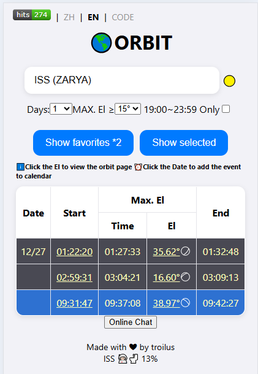
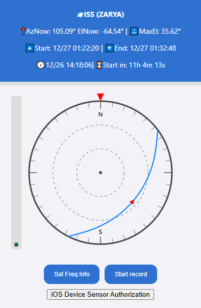
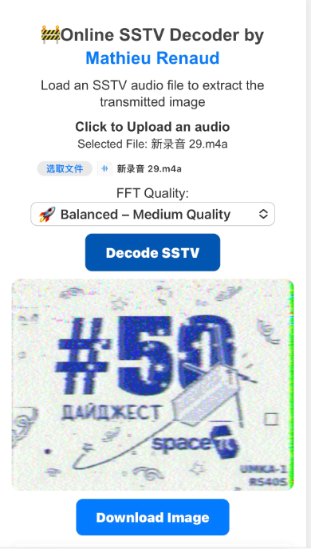

# Satellite tracker

Based on https://github.com/troilus/predict

[User Manual](https://github.com/troilus/predict/blob/main/HowToUse.md)

## Features
- Specific satellite pass information calculation
- Collecting pass information for satellites
- Use the phone to point at the satellite
- Multilingual
- Add to calendar reminder
- Freq doppler display
- SSTV decode(based on https://github.com/Equinoxis/sstv-decoder)

## Host

1. Create a local SSL cert
```shell
cd cert;

openssl req -x509 -newkey rsa:2048 -nodes -sha256 -keyout localhost.key -out localhost.crt -days 365 \
  -subj "/C=US/ST=New York/L=New York/O=SatTracker/OU=Dev/CN=localhost"
```
If using iOS, you need to send the localhost.crt to the phone, install it as a profile and allow trust as a root certificate.

2. Start the HTTPS server
```shell
python3 server.py <optional port>
```
3. Visit  in browser
4. Update TLE database

```shell
curl -k -o satonline.txt https://r4uab.ru/satonline.txt;

sed -i 's/ASRTU-1 (RS64S\/BJ2CR)/ASRTU-1 (RS64S\/BJ2CR\/AO-123)/g' satonline.txt;

curl -o transmitters.json "https://db.satnogs.org/api/transmitters/?format=json&status=active";
```

---





## Sources
- https://r4uab.ru/ (TLEs)
- https://github.com/shashwatak/satellite-js
- https://github.com/mourner/suncalc
- https://github.com/Equinoxis/sstv-decoder
