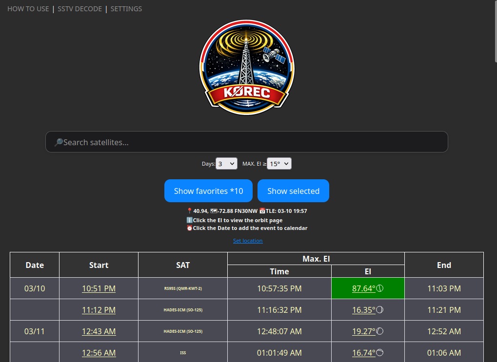
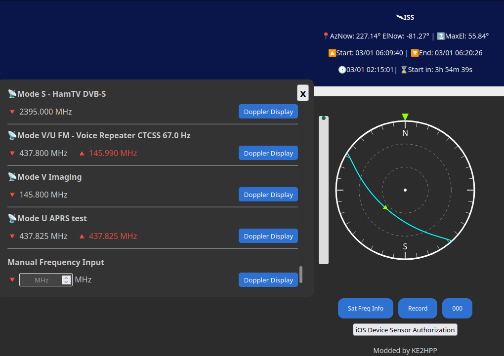
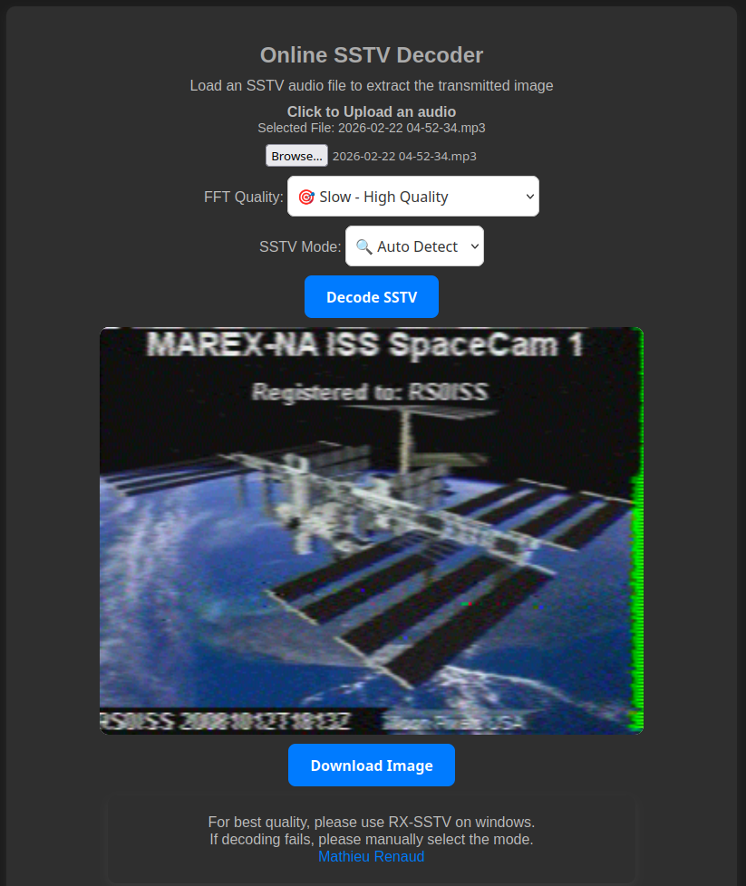

# Satellite tracker

## Features
- Satellite pass predictions
- Use the phone to point at the satellite (azimuth and elevation tracking)
- Real-time frequency doppler shift calculation
- Audio recording for your QSOs or SSTV transmissions
- SSTV decoding
- Add calendar reminders

[User Manual](https://github.com/Drakmord2/sat-tracker/blob/main/HowToUse.md)

## Self Hosting

1. Create a local SSL cert
```shell
cd cert;

openssl req -x509 -newkey rsa:2048 -nodes -sha256 -keyout localhost.key -out localhost.crt -days 365 \
  -subj "/C=US/ST=New York/L=New York/O=SatTracker/OU=Dev/CN=localhost";
```
If using iOS, you need to send the localhost.crt to the phone, install it as a profile and allow trust as a root certificate.

2. Start the HTTPS server (default port: `8987`)

### Option A: Docker Compose

Start (detached) using Docker Compose:
```shell
chmod +x ./start_server.sh
./start_server.sh
```

If you need a different host port:
```shell
./start_server.sh 8990
```

This uses a non-root container user by mapping your host UID/GID (`HOST_UID`/`HOST_GID`) so the container can read `./cert/localhost.key` even if it is `0600` on the host.

### Option B: Run locally with Python

```shell
python3 server.py <optional port>;
```
3. Update TLE database

```shell
sh ./update_tle.sh
```
4. Visit https://localhost:8987 on a browser

# Previews





## Sources
- Based on https://github.com/troilus/predict
- https://www.amsat.org (TLEs)
- https://db.satnogs.org (Active satellites)
- https://github.com/shashwatak/satellite-js
- https://github.com/mourner/suncalc
- https://github.com/Equinoxis/sstv-decoder
